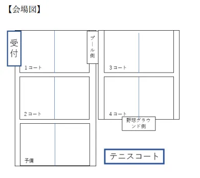

# ソフトテニス

## 試合の進め方

1. 開始時間になったらコートに集合します
2. 審判の合図で試合を開始します
3. 結果は試合終了後すぐに記録係へ報告します

## 競技ルール
- 1リーグ3～4クラスの計7リーグ(24試合)で予選リーグを行い、各リーグ1位の7クラスが決勝へ進むことができる
- 予選リーグは1マッチ3ゲームで行い、デュースなしの1ゲーム4ポイント先取で行う(競技時間：一試合あたり10分)
- 決勝では(3決も含む)トーナメント形式で行う
- 決勝トーナメントでは1マッチ5ゲームで行い、デュース有りの1ゲーム4ポイント先取で行う(競技時間：一試合あたり20分)
- 決勝、準決勝、3位決定戦は本部にオーダーを提出すること
- 予選トーナメントでは主審のみ、決勝トーナメントでは主審と副審がつくものとする
- 競技中の選手交代は選手が負傷した場合のみ認める
- ラケットは体育大会実行委員会で貸し出しを行うが、個人所有のラケットを使用してもよい
- 時間が過ぎた場合は試合を強制終了して得点差で勝敗を決める
- 競技人数が足りない場合、2以上揃っていれば試合を開始して構わない。なお、前のペアの試合が終わった時点で次のペアの人数が足りない場合は不戦敗となる
- 予備のコートの使用は、原則禁止とする

## 注意事項

- 本競技開催中、参加者はすべて運営者の指示に従って行動すること
- 会場内での全ての暴力を禁じ、実行した参加者は処置の対象とする
- 参加者同士の妨害行為は禁止とし、行った場合は処置の対象とする
- 参加者が故意または重大な過失により試合以外の時間にコートに入るなどの妨害行為をした場合、運営者は処置を加えることがある
- ラケット借用の際は試合開始前にそのコートにつく審判から貸出をうけること、また試合終了後、速やかに審判へ返却すること
- 高専入学後に、軟式または硬式テニス部に所属したことのある者、または高体
連主催大会もしくは高専大会に出場した経験のある者は 3 人までとする