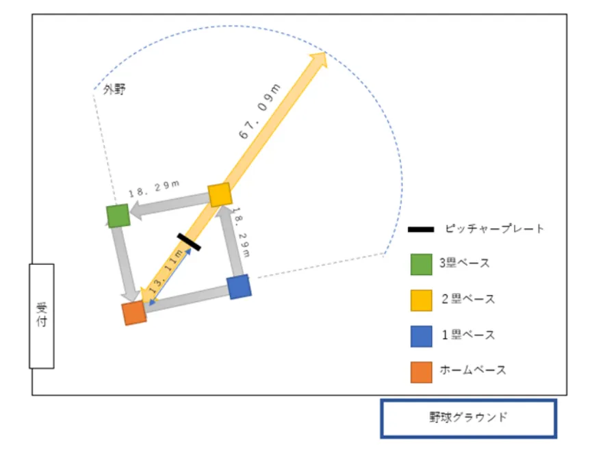

# ソフトボール競技ルール

- 試合開始予定時刻から5分以上遅れた場合、遅れたクラスは棄権とする。
- 人数が足りない場合は同クラスからの助っ人の参加を許可する。
- 個人のグローブは持ち込みを認めるが、その場合は学校のものと混ざらないように自己管理を行う。
- 盗塁及びバントはなし。
- 打球がホームランラインから転がり出た場合はエンタイトルツーベースとし、ランナーがいる場合そのランナーは塁を二つ進める。
- 内野でファーストへの送球ミスをした場合、バッターランナーは2塁までしか進めない。
- 金属刃のスパイクシューズの使用は認めない。
- ワイルドピッチは適用されない。
- 明らかなポーク(プレートから大きく離れるなど)は取る。
- ホームランゾーンでボールを取ってもホームランとする。
- タッチアップ、ヒットエンドランはなしとする。
- 0アウト、1アウトでランナー1・2塁もしくは満塁の場合、審判の宣言に関わらずフライが上がった時点でインフィールドフライとする。
- 走者が塁を離れてよいのはピッチャーがボールを投げた時とする。
- デッドボールは2ボールとしてカウントする。ただし、故意に当たった場合はストライクとする。

- ビヨンドバット(打撃部がゴム製のもの)の使用は禁止とする。
- 安全のため、キャッチャーはキャッチャーマスクを必ず着用すること。

## 試合の進め方

1. 試合はトーナメント形式で行う。
2. 1試合当たり最大3イニングで行う。
3. 審判が試合のコールを行い、試合を開始する。
4. 1回終了後8点以上の差だった場合はコールドゲームとする。
5. 試合開始後20分経過後に同点の場合は次の回よりタイブレーク方式を適用する。なお、タイブレークにおいても勝敗が決しない場合はスタンディングメンバーが1名ずつじゃんけんを行い、勝利数の多いチームを勝利とする。
6. タイブレーク：1アウト満塁で開始し、前の回でバッターアウトした次のバッターからの攻撃とする。

## 注意事項

- 競技開催中、参加者はすべて運営者の指示に従って行動する。
- 会場内の全ての暴力行為を禁じ、行った場合は処置の対象とする。
- 参加者同士の妨害行為は禁止とし、行った場合は処置の対象となる。
- ボール(1チーム4つまで)はグローブ/バットと同時に貸し出すが、ボールのみ試合前に返却することにする
- 野球グラウンド内ベンチへの立ち入りを禁止する

