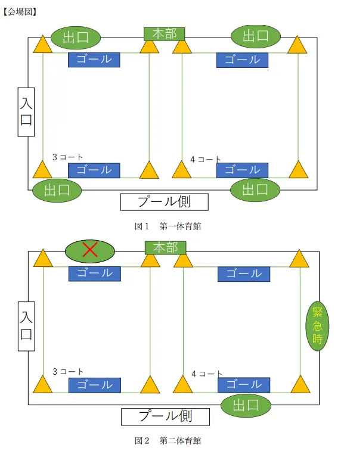

# バスケットボール

## 競技ルール
- 1試合2ピリオドで行う。なお各ピリオドでバスケットボール部は1人のみ出場できるものとする
- 試合人数を予選リーグは4対4、決勝トーナメントは5対5で行う
- 予選リーグは1ピリオド5分とし、ピリオド間に休憩2分をはさむ
- 予選リーグでは各ピリオドでメンバーを4人入れ替えること。
(チームにバスケットボール部を1人しか含まない場合、2ピリオド連続でバスケ部を出場させてもよいものとする)
- 決勝トーナメントは1ピリオド6分とし、ピリオド間に休憩2分をはさむ
- 試合終了時、点数が多いほうを勝ちとする
- 決勝トーナメントのみ3ポイントルールを適用する
- 同点の場合は代表者によるフリースロー対決(予選1名/決勝3名)で勝敗を決める
- 試合中に事故等アクシデントが起こった場合は実行委員と両チームキャプテンの相談の元、点数及び規定時間が満たされていない場合でも試合を強制終了し、勝ち負けを定める可能性がある
- トラベリング(ボールを持ったまま3歩以上歩くこと)、ダブルドリブル(ドリブルを止めた後またドリブルをすること)を適用する
- 過度な接触など審判がファールと判断する場合がある。ファールをした場合相手チームからの攻撃とする
- 1試合中におけるチームの累積ファウルが5回に達した場合、そのチームを敗退とする
- コートからボールが出た場合、ボールが出た場所から必ず審判に渡したのち相手チームの攻撃で再開すること
- 試合が停止した場合、ボールは速やかに審判へ渡すこととする
- バスケットボール部がゴールを決めた場合、2・3点→1・2点とする
- 女子がゴールを決めた場合、2・3点→3・4点とする

## 注意事項
- 本競技開催中、参加者はすべて運営者の指示に従って行動する
- 会場内での全ての暴力を禁じ、行った参加者は処置の対象となる
- 参加者同士の妨害行為は禁止とし、行った場合は処置の対象となる
- 第二体育館の出入りにおいて東寮側の扉は使用しない。また、寮事務室側の扉は緊急時を除き使用しない
- 高専入学後に、バスケットボール部に所属したことのある者、または高体連主催大会もしくは高専大会に出場した経験のある者は2人までとする
- 審判の判断は最終決定とし、抗議は禁止とする
- スポーツマンシップに反する行為や過度なヤジが行われた場合、強制退場やチーム敗退の処分を下す場合がある
- ***審判の笛が鳴った場合、観客側はなるべく静かにするようにし、試合の進行を妨げないこと***
- 試合が終了したコートから次チームの練習を可能とする
- 試合開始時、チームの人数が足りない場合も試合に参加する事は可能とする。なお試合への途中参加は原則禁止とする
- 予選リーグではメンバー交代は原則禁止とする
- 決勝トーナメントでは、メンバーの途中交代を可能とする