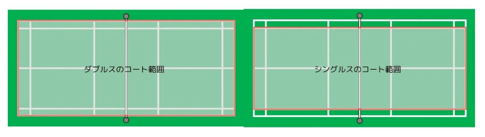
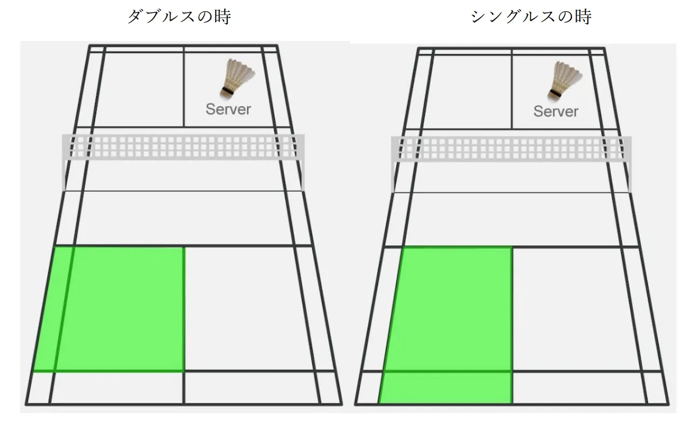

# バドミントン

## 試合の進め方
1. じゃんけんを行い、勝者がサーブかレシーブを選ぶ（2セット目以降は第1セットの勝者がサーブ権を持つ）
2. 第一シングルスの試合を行う
3. 第二シングルスの試合を行う
4. ダブルスの試合を行う（シングルスの試合結果に関わらず行う）

## 競技ルール
- 予選は各学年でリーグ戦を行い、1位と2位のみ決勝へ進むことが出来る
- 決勝はトーナメント形式で行う
- 専攻科チームと教員チームは予選免除とし、決勝トーナメントからの出場とする
- 試合は1セット8点先取マッチで1ゲーム2セット先取とする
- 2ゲーム先取したクラスが勝利となる
- 1試合が7分を超えた場合打ち切りとしてその時点での得点でゲームの勝敗を決める
- シングルスとダブルスのコートの大きさはそれぞれ下図ように示す

- ラケット借用時は試合開始前にそのコートにつく審判から貸し出しを受けること
- 準決勝以降のイン・アウトの裁定は線審が行う
- サーブにおいてサーバー側が相手側に落とすことが出来るサービスエリアを下図のように示す（緑のエリアが図右上のサーバー側から見たサービスエリアである）
- サーブはサーバー側の得点が奇数なら左側から、それ以外なら右側から対角線上にあるサービスエリアに向かってサーブを行う
- サーバー側が得点を取った場合はサーバーはそのまま同じ者が行う

## 特記事項
- 競技開催中、参加者はすべて運営者の指示に従って行動すること
- ラケットは体育大会実行委員で貸し出しを行う。（ただし個人所有のラケットがあれば試合で使用してもよい）
- 借用したラケットは試合後すみやかに審判へ返却を行うこと

## 注意事項
- 会場内でのすべての暴力を禁じ、実行した者は処置の対象となる
- 体育大会実施時間内での一切の妨害行為を禁じ、実行した者は処置の対象となる
- 借用したラケット等の物品の体育館外への一切の持ち出しを禁ずる
- 高専入学後に、バドミントン部に所属したことのある者・高体連主催大会もしくは高専大会に出場した経験のあるものは1人までとする
- バドミントン部の部員が同じクラスから複数人出ている場合失格とする
- 他のクラスからのサポートとしての人員でもそのクラスの出場メンバーでバドミントン部が複数人いる場合失格となる
- 一度バドミントンの他のゲームに出た者は原則出場できない（場合によっては不戦敗とする）