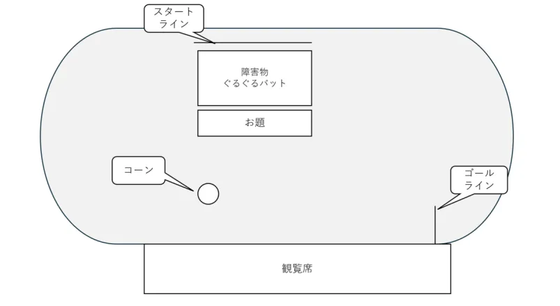

# 借り人競争

## 試合の進め方
1. 競技者は、スタートラインに立ちスタートの合図と同時に走り出す。
2. 数メートル先で 10 回ぐるぐるバットを行う
3. その先の、お題の置かれた長机に向かって走る
4. お題を引き、お題に該当する人物を審判のもとまで連れて行く
5. そのお題に当てはまっているか審査をする。審判は、競技リーダー（吉田）と実行委員長（佐々木）とする
6. お題に書いてあることに当てはまらなかった場合は、指定のコーンを回ってからゴールすること

## 競技ルール
- 得点配分は以下のようになる
    >1位…4点、2位…3点、3位…2点、4位…1点
- 各学年の3セットで順位ごとのポイントの合計が一番高いクラスが決勝に進出する
- 出場者は1クラスから代表複数名とする

## 特記事項
- 専攻科生の選手としての協議参加は決勝からとする
- グラウンドの会場図は以下のようになる

## 注意事項
- 会場内でのすべての暴力を禁じ、実行した者は処置の対象となる
- 体育大会実施時間内での一切の妨害行為を禁じ、実行した者は処置の対象となる
- 競技者は、嫌がる人を無理やり前に連れて行ってはならない
- トラブル対応のための人員を配置する
- フライングは禁止。注意してもなお、やめない場合は失格とする