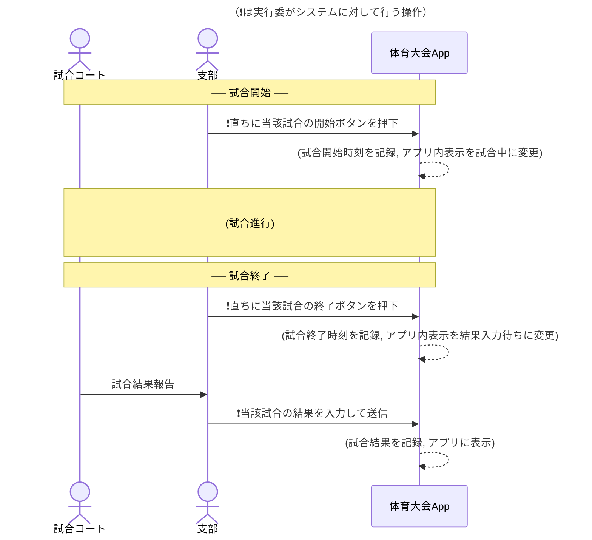
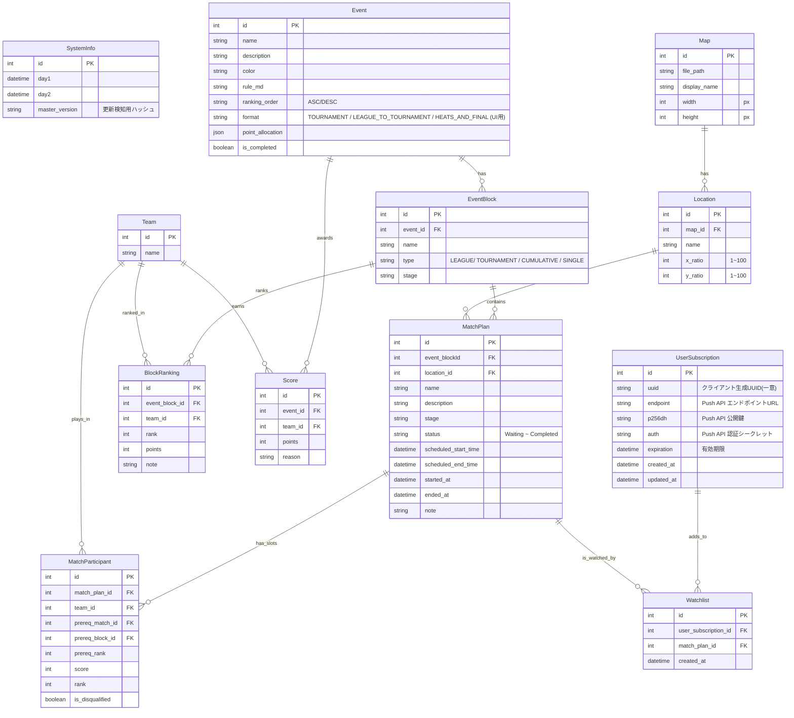

# 令和8年度体育大会App (仮称) に関する企画･設計書
<p style="text-align: right;">
v1.0<br/>
令和8年3月29日<br/>
f22092 5J 高橋翔太
</p>

## 1. 企画
### 1.1. 企画概要
<span style="margin-left: 1em;"></span>本Webアプリ(以下速報アプリと仮称)は, 本校体育大会における対戦スケジュール, 試合結果, 遅延状況といった様々な情報を学生･教員がリアルタイムで確認できるWebアプリを提供することを目的としている.  

この速報アプリは去年度(R7)の体育大会で初めて開発･運用され, 今年で2回目となる.


### 1.2. 本アプリが解決したい課題
R6年度以前の大会では, 下記のような不便が発生していた.
- 各種目の進行度や試合結果は, 直接試合会場の結果ボードを見なければ確認できない.
- 試合会場の結果ボードは各会場の実行委員が手書きで更新しており, ビジー時は数試合してから更新されることもある.  
   → 遅延が発生した場合, 学生は会場に行って今どの試合をやっているのか聞いて回らないと進行状況が分からない.
- (体験談) スケジュールに従って自クラスの応援をしに行ったら遅延しており, ちょうど一つ前の試合が始まったところだった. 
- (R7実行副委員長談) 実行委員内で総合順位を求める際には各支部から本部にスコアや勝敗数を集約するが, ここで情報が欠落したり数字が合わなくなっていた. トランシーバーがてんやわんやになっていた.

本アプリは各支部で試合が終了する度に入力される情報を自動で処理･公開し, 上記のような不便を解決することを期す.

### 1.3. ステークホルダー
本アプリのステークホルダー(関わる人や組織)は以下の通りである.

- 直接関与
  - **電算･シス研 Web開発チーム**: 本アプリの開発･運用を行う.
  - **R8体育大会実行委員会(の各支部担当)**: 運用(結果データ入力)を行う.
  - **電算部Network班**: 本アプリのバックエンドサーバーの構築･管理を行う.
    - 問い合わせ先: f22092 5J 高橋翔太
  
- 間接関与 
  - **和山先生 (総合情報センター長)**: サブドメイン及びバックエンドサーバー用校内回線(電算NW)の貸与申請先

### 1.4. 実行委側運用フロー
- 体育大会実行委員会の各支部(一体支部, テニスコート支部, グラウンド支部等...)は当日, 以下のように本システムへの入力を行う.
  - 各コートでの試合開始時にスタートボタンを押す
  - 各コートでの試合終了時に終了ボタンを押す
  - 結果入力待ち状態になるので, 一試合ずつ試合結果を入力する.



## 2. 要件定義
### 2.1. ページ割
※ [:id]のようなパスはslugを表す.
#### 2.1.1. トップページ (/)
  - ウォッチリストの試合を一覧表示する. 
  - 現在進行中の試合情報をピックアップ.
    - 表示順は, 経過時間が短い(始まったばかり)か長い(終了が近い)かを切り替えられるようにする.
    - (前者はこれから自分が見に行けるor参加する試合を知りたいというニーズ, 後者は白熱しているor結果を現場で見たいといったニーズ向け.)
  - 直近で終わった試合の結果を表示.
    - (さっきの試合の自クラスの勝敗を知りたいという動機.)
  - PWA登録されていない場合は登録を勧める文言を記載する.
  - 自分のクラスを登録する選択項目.
    - (PWA化されていて通知が無効な場合)
    - (PWA化されていて通知が有効な場合)ウォッチリストの試合の開始/終了で通知を受け取るかどうかを設定する項目を用意する.
    - (PWA化されていて通知が有効な場合)自クラスの試合の開始/終了で通知を受け取るかどうかを設定する項目を用意する.
      - (自クラスの試合)
#### 2.1.2. マップ (/map)
  - 会場や体育館内の区画割りなどを示し, 場所ごとの試合スケジュールが閲覧可能.
  - (ページとして存在させず, 検索フォームに「場所から探す」機能を持たせる形として統合しても良い.)   
    
  <center>参考画像1: R7体育大会App (左: /mapページ. 右: 会場を選択した場合)</center>

#### 2.1.3. 種目一覧ページ (/event)
  - 各種目ページへのリンクを表示する.
  - (可能であれば)各種目の試合完了数をもとにした進行度の割合を表示する.
#### 2.1.4. 種目詳細ページ (/event/[:event_id])
  - 種目ごとの現状順位, 次の対戦, 会場など(一体, 二体程度の粒度)を記載する.
  - 各種目のルールを掲載?
    - 各競技の企画書から概要, ルールなどをHTMLに起こす. 必要な情報にすぐアクセスできるようハイパーリンクをつける.
    - (mdを読み込めるようにして一般化できると良いかも)
#### 2.1.5. 試合検索ページ (/match)
  - ここで試合の検索を行う.
  - 検索に使うのは「種目(必須)」「関与クラス(必須)」「会場(余力があれば)」「システム管理IDによる検索(#〇〇, 余力があれば)」である.
  - 検索結果のカードが表示され, これを押すと対応する試合詳細ページに遷移する.
  - 検索結果のカードの横にはウォッチリスト追加ボタンを用意する.
#### 2.1.6. 試合詳細ページ (/match/[:match_id])
  - 元のページ及び元の表示領域に戻るボタンを用意する.
  - 共有ボタンを用意する.
  - トップ画面や対戦表など, 様々な箇所から遷移される. 必要であればNext.jsのIntercepting Routesを使用するとUX向上に寄与する.
  - LINE等でのリンク共有や, 通知から直接遷移に対応するためにページとして独立させた.
  - 以下のように, 各試合の情報を表示する.
    - 種目
    - 状態
    - 会場名
    - 会場の場所を示す地図
    - 対戦チーム
    - システム管理ID
      - DBのMatchPlanテーブルのプライマリキー.
      - 「#1」のように#をつけて表示. 
      - 問い合わせによりDBを直接操作する必要がある際などに使用する.
    - 備考
    - 試合名
      - スケジュールのPDFに記載されている試合名. A-1や①など.
    - 種目説明ページ(/event/[:event_id])へのリンク
    - トーナメント表を表示する
    - (未実施の試合の場合)
      - 開始予定時刻
      - 終了予定時刻
    - (進行中の試合の場合)
      - 実際の開始時刻
      - 予定されていた開始時刻(小さく薄く)
    - (終了した試合の場合)
      - 実際の開始時刻
      - 実際の終了時刻
      - 実際の試合時間
      - 予定されていた開始時刻(小さく薄く)
      - 予定されていた終了時刻(小さく薄く)
      - 試合結果
  - ウォッチリストに追加するボタンを表示.

#### 2.1.7. スケジュール (/schedule)
  - スケジュールPDFを直に載せ, 現在時刻の場所に赤い横線を入れる.
  - (動的にスケジュール表を作成できる場合はそれを使用してもよい.)
  - スケジュール表に各時間における天気予報を併記する.
  
#### 2.1.8. 支部用画面 (/dashboard)
  - 実行委･管理者のみ表示可能なページであり, ログインが必要である.
  - 表示する場所を選択し, 各場所ごとに試合の開始/終了ができるようにする.
  - スケジュールに従い, 同じ時間に始まる試合は一括で開始/停止できるようにする.
    - 必要に応じて一括操作をしない選択肢も用意する.
  
    
  <center> 参考画像2: R7体育大会App </center>

  
#### 2.1.9. ログイン (/login)
  - 会場スタッフしかデータを変更できないようにするために必要である.
  - 簡素な画面で十分とする.
  - 実行委は共通アカウントとする.

###  2.2. コンポーネント化が必須である機能
  コンポーネントのpropsについては別途定めるものとする.
  #### 2.2.1. 試合カード  
    別途Figmaのデザインで定める内容を表示する. 
  #### 2.2.2. 対戦表
  - トーナメント表
    - 各結節点に試合名(スケジュール準拠)が表示される.
    - 試合名を押すと試合詳細ページに遷移 (propsで本機能の有効/無効を切り替えられる).
  - リーグ表
    - 画像を参考にする. 
    - 未実施の試合のセルは試合名(スケジュール準拠)が表示される.
    - セルを押すと当該試合詳細ページに遷移 (propsで本機能の有効/無効を切り替えられる).
  - 学年代表決定型の対戦表
    - リーグ表同様, 関係する試合を表示できるようにする.
    - 別途Figmaのデザインを参照すること.
  

### 2.3. 非機能要件
#### 2.3.1 パフォーマンス要件
| 要件ID | 要件名               | 要件内容                                                                                                      | 備考                |
| ------ | -------------------- | ------------------------------------------------------------------------------------------------------------- | ------------------- |
| NF-P01 | ページ初回ロード     | 初回ページ表示に要する時間を3秒以内とする                                                                                 | LCP 基準            |
| NF-P02 | API レスポンス       | RESTAPIエンドポイントの応答を1秒以内とする                                                                    | 通常時              |
| NF-P03 | データ自動更新       | アプリがアクティブである(端末で表示されている)場合は一般公開ページのデータを15秒間隔で更新する                                                                    | SWR refreshInterval |
| NF-P04 | サイト内遷移       | サイト内のページ遷移(特に試合詳細ページの表示)に要する時間を1秒以内とする                                                                    | コンポーネントの共通化やメモ化を積極的に活用する |
| NF-P05 | キャッシュ           | Next.js のサーバーサイドキャッシュを活用し, データベースへの不要なアクセスを抑制する                          |                     |
| NF-P06 | 通信量の最小化       | 通信量制限に配慮し、定期フェッチするライブAPIのレスポンスサイズを切り詰める                                   |                     |
| NF-P07 | マスタデータ更新検知 | `SystemInfo.masterVersion` のハッシュ値を用いて, 変更があった場合のみマスタデータを再取得する仕組みを導入する | 通信量削減のため    |


#### 2.3.2 セキュリティ要件

| 要件ID | 要件名             | 要件内容                                                                 | 備考                              |
| ------ | ------------------ | ------------------------------------------------------------------------ | --------------------------------- |
| NF-S01 | 認証方式           | 管理機能へのアクセスはCookieベースのセッション認証で保護する             |                                   |
| NF-S02 | ルート保護         | `/dashboard` などの管理パスに対し, Middleware による認証チェックを行う   |                                   |
| NF-S03 | 環境変数管理       | パスワード・暗号鍵等の機密情報は環境変数で管理し, ソースコードに含めない |                                   |
| NF-S04 | 入力バリデーション | サーバーサイドで Zod等を用いた入力スキーマ検証を実施する                 |
| NF-S05 | HTTPS 強制         | 本番環境では全通信を HTTPS で行う                                        |                                   |
| NF-S06 | パスワード強度     | 実行委パスワードは十分な複雑性 (英数字記号混在12文字以上) を要求する     | 運用ガイドライン                  |
| NF-S07 | XSS対策(Markdown)  | rule_md等のmdデータを送信･表示する際にはサニタイズ処理を必ず実施する.    | 競技ルールページ等での脆弱性防止. |

#### 2.3.3 可用性・信頼性要件

| 要件ID | 要件名           | 要件内容                                                        | 備考                                          |
| ------ | ---------------- | --------------------------------------------------------------- | --------------------------------------------- |
| NF-A01 | 稼働時間         | 大会開催期間(最大2日間)は99%以上の稼働率を確保する              |                                               |
| NF-A02 | データ整合性     | 試合結果登録・得点確定はトランザクション処理で原子性を保証する  | データがぐちゃぐちゃになることを避ける.       |
| NF-A03 | 障害復旧         | データベース障害時は最後の正常状態に 1 時間以内に復旧できること |                                               |
| NF-A04 | バックアップ     | 大会開催日には 1 日 1 回以上データベースバックアップを取得する  | 手動でも可                                    |
| NF-A05 | 全体ハッシュ取得 | 運用開始時のソースコード全体でハッシュ値を生成しておく.         | 仮に攻撃された場合にコード改変を検知するため. |

#### 2.3.4 スケーラビリティ要件

| 要件ID  | 要件名     | 要件内容                                               | 備考 |
| ------- | ---------- | ------------------------------------------------------ | ---- |
| NF-SC01 | 同時接続数 | 一般閲覧者200名程度の同時アクセスに対応する            |      |
| NF-SC02 | データ量   | チーム数52程度・試合数200以上・競技種目7程度に対応する |      |
| NF-SC03 | 会場数     | 細分化後された単位で20会場程度に対応する               |      |

#### 2.3.5 保守性要件

| 要件ID | 要件名               | 要件内容                                                                                               | 備考                                                           |
| ------ | -------------------- | ------------------------------------------------------------------------------------------------------ | -------------------------------------------------------------- |
| NF-M01 | コード品質           | ESLint/Biome等のツールによる静的解析をCIで実施する                                                     |                                                                |
| NF-M02 | 型安全性             | TypeScriptのstrictモードを有効にし, 型エラーをビルド前に検出する                                       | @ts-ignoreを使用していたら土壇場でビルドエラーを吐いたので注意 |
| NF-M03 | テスト               | 主要なビジネスロジック(リーグ順位計算･勝ち上がりチーム解決･得点計算等)に対してユニットテストを整備する | これを怠って去年スコア計算に不備を出したので注意               |
| NF-M04 | ドキュメント         | API・データモデル・環境変数の仕様をドキュメント化する                                                  |                                                                |
| NF-M05 | Docker採用           | バックエンドのプログラムはDocker上で動作するようにする                                                 | 電算NW班サーバーへのデプロイを容易にするため                   |
| NF-M06 | 大会後クリーンアップ | 大会終了後、不要となったService Workerの登録解除と通知サブスクリプションの自動削除が行える設計とする   | DBの有効期限管理と連動                                         |


#### 2.3.6 ユーザビリティ要件

| 要件ID | 要件名                             | 要件内容                                                                                  | 備考                                            |
| ------ | ---------------------------------- | ----------------------------------------------------------------------------------------- | ----------------------------------------------- |
| NF-U01 | 一般者閲覧画面のスマートフォン対応 | 実行委向け画面を除き, スマートフォンでの閲覧を前提としたレイアウトにする.                 |                                                 |
| NF-U02 | 試合状態の視認性                   | 試合ステータスをカード枠色, バッジ等で即座に判別できる                                    |                                                 |
| NF-U03 | オフライン通知                     | ネットワーク断線時にユーザーへ通知を表示する                                              | 更新不可の旨を伝えれば良い                      |
| NF-U04 | PWAインストール促進                | 未登録のユーザーに対しては, トップページ等でPWA登録を促す文言を提示する                   |                                                 |
| NF-U05 | 重複リクエストの防止               | データの変更などを伴うボタンは処理が完了するまでロックし, 処理中アニメーションを表示する. | 主に実行委画面の試合開始やスコア入力ボタンなど. |

---

## 2.4. 機能要件

### 2.4.1 認証・認可

| 要件ID | 機能名         | 要件内容                                                                  | 優先度 |
| ------ | -------------- | ------------------------------------------------------------------------- | ------ |
| F-AU01 | ログイン       | 実行委パスワードを入力して認証を行い, 暗号化Cookie セッションを発行する   | 必須   |
| F-AU02 | ログアウト     | セッションCookieを削除し, ログインページへリダイレクトする                | 必須   |
| F-AU03 | ルート保護     | `/dashboard` などの管理機能へのアクセスを認証済みセッションのみに制限する | 必須   |
| F-AU04 | セッション検証 | Cookieの復号により有効なセッションか検証する                              | 必須   |

### 2.4.2 チーム管理
(マスタデータであること及びアプリの規模を考慮すると, 機能を設けずに直接SQLで作成しても良い. 但し, )
| 要件ID | 機能名         | 要件内容                                  | 優先度 |
| ------ | -------------- | ----------------------------------------- | ------ |
| F-TM01 | チーム一覧表示 | 登録済みチームの一覧（ID･名称）を表示する | 推奨   |
| F-TM02 | チーム作成     | チーム名を指定して新規チームを登録する    | 推奨   |
| F-TM03 | チーム編集     | チーム名を変更する                        | 推奨   |

### 2.4.3 競技種目管理

| 要件ID | 機能名               | 要件内容                                                                     | 優先度 |
| ------ | -------------------- | ---------------------------------------------------------------------------- | ------ |
| F-EV01 | 種目一覧表示         | 競技種目の一覧(ID･名称･完了状態等)を表示する                                 | 必須   |
| F-EV02 | 種目作成             | 種目名･説明･チーム構成データ(リーグ/トーナメント/混合形式)を設定して作成する | 必須   |
| F-EV03 | 種目編集             | 種目名･説明･チーム構成データを変更する                                       | 必須   |
| F-EV04 | 種目完了設定         | 全試合終了後に種目を「完了」状態にする（手動･自動両対応）                    | 必須   |
| F-EV05 | リーグ形式対応       | ブロック分けリーグ戦に対応する（複数ブロック可、勝点・得失点差・順位計算）   | 必須   |
| F-EV06 | トーナメント形式対応 | シングルエリミネーション・トーナメントブラケットに対応する                   | 必須   |
| F-EV07 | 学年代表選出形式対応 | 学年ごとでの予選 → 決勝戦のハイブリッド形式に対応する                        | 必須   |

### 2.4.4 試合計画管理

| 要件ID | 機能名           | 要件内容                                                                                                | 優先度 |
| ------ | ---------------- | ------------------------------------------------------------------------------------------------------- | ------ |
| F-MP01 | 試合計画一覧表示 | 全試合の一覧(試合名･種目･会場･時間･状態)を表示する                                                      | 必須   |
| F-MP02 | 試合計画作成     | 種目･対戦チーム･開始/終了予定時刻･会場･試合名を指定して試合を作成する                                   | 必須   |
| F-MP03 | 試合計画編集     | 試合の各項目を変更する                                                                                  | 必須   |
| F-MP04 | 試合計画削除     | 試合計画を削除する                                                                                      | 必須   |
| F-MP06 | 依存関係自動解決 | 勝ち上がりによる依存関係を持つ試合は, 参照先試合の結果確定後に自動的に参加チームを解決する              | 必須   |
| F-MP07 | 状態管理         | 試合ステータスを `Waiting / Preparing / Playing / Finished / Completed / Cancelled` の 6 状態で管理する | 必須   |
| F-MP08 | 試合開始記録     | 試合開始時に `startedAt` タイムスタンプを自動記録する                                                   | 必須   |
| F-MP09 | 試合終了記録     | 試合終了時に `endedAt` タイムスタンプを自動記録する                                                     | 必須   |

### 2.4.5 試合結果登録

| 要件ID | 機能名             | 要件内容                                                                                                                                                                  | 優先度 |
| ------ | ------------------ | ------------------------------------------------------------------------------------------------------------------------------------------------------------------------- | ------ |
| F-MR01 | 結果入力フォーム   | `status=Finished` のとき, 試合結果入力フォームを表示する                                                                                                                  | 必須   |
| F-MR02 | スコア入力         | チームごとにスコアを入力する                                                                                                                                              | 必須   |
| F-MR04 | 勝者選択/順位入力  | 1vs1の試合においてはラジオボタンで勝者チームを選択する. このとき勝者チームのrankを1, もう一方のrankを2とする. 1vs1ではない試合においては順位の手動入力フィールドを設ける. | 必須   |
| F-MR05 | 失格登録           | 試合結果入力においては失格フラグを登録できるようにする                                                                                                                    | 推奨   |
| F-MR06 | 依存チェック       | 勝ち上がりチームが未解決の場合は入力をブロックし, 依存試合結果待ちである旨を表示する                                                                                      | 必須   |
| F-MR07 | 試合結果確定       | 結果登録と同時に試合ステータスを `Completed` に更新する                                                                                                                   | 必須   |
| F-MR08 | リーグ順位自動更新 | 結果登録後、当該ブロックの全チームのリーグ順位(勝点･得失点差･勝敗数)を再計算する                                                                                          | 必須   |
| F-MR09 | リーグ順位介入     | リーグ順位の確定時に実行委が介入でき, またその理由を登録できる. (スコア同点によりじゃんけんで順位が決定された場合などを想定.)                                             | 推奨   |
| F-MR10 | 試合結果編集       | 開発チームの介入によって登録済みの結果を修正できる (入力ミスの対処用. 試合間の依存関係によっては修正適用範囲が広範囲に及び, 自動再計算では複雑性がリスクになるため.)                                                                                                                    | 推奨   |
| F-MR11 | 試合結果備考       | 備考を結果に付記できる                                                                                                                                                    | 推奨   |

### 2.4.6 会場管理

| 要件ID | 機能名         | 要件内容                                                                                                                          | 優先度 |
| ------ | -------------- | --------------------------------------------------------------------------------------------------------------------------------- | ------ |
| F-LO01 | 会場一覧表示   | 登録済み会場の一覧を表示する                                                                                                      | 必須   |
| F-LO02 | 会場作成       | 会場名と説明, 並びに地図を表示するために必要な要素(フロントでの画像パス及び画像中でのピンを指す場所) を設定して新規会場を作成する | 必須   |
| F-LO03 | 会場編集       | 会場情報を変更する                                                                                                                | 必須   |
| F-LO04 | 会場マップ表示 | 会場の位置を画像マップ上にピンとして表示し, タップで詳細(スケジュール等)を表示できる                                              | 必須   |
| F-LO05 | 試合フィルタ   | 管理画面および公開検索機能で, 会場別に試合一覧を絞り込む                                                                          | 必須   |

### 2.4.7 得点管理

| 要件ID | 機能名         | 要件内容                                                                    | 優先度 |
| ------ | -------------- | --------------------------------------------------------------------------- | ------ |
| F-SC01 | 種目別配点記述 | 種目に応じた大会スコアの加算ルールをJSONで記述できるようにする              | 必須   |
| F-SC02 | 種目別順位計算 | 予選(リーグ)･決勝(トーナメント)の各フェーズの順位から種目得点を自動計算する | 必須   |
| F-SC03 | 得点確定       | 管理者が確認後にチームごとの種目得点を一括確定する                          | 必須   |
| F-SC04 | 総合得点集計   | 全種目の確定得点を合算し, チーム総合順位を算出・表示する                    | 必須   |

### 2.4.8 公開情報表示

| 要件ID | 機能名                   | 要件内容                                                                                                                                                                                                            | 優先度 |
| ------ | ------------------------ | ------------------------------------------------------------------------------------------------------------------------------------------------------------------------------------------------------------------- | ------ |
| F-PU01 | トップページ             | 進行中・直近完了の試合ピックアップやウォッチリスト一覧を表示するトップページを提供する. 進行中の試合は経過時間が少ない試合を優先的に表示する.                                                                       | 必須   |
| F-PU02 | 日程表示                 | 大会スケジュールを日付別で表示する                                                                                                                                                                                  | 必須   |
| F-PU03 | 会場マップ               | 任意の試合に対し, 会場の位置情報を地図画像上に表示できる                                                                                                                                                            | 必須   |
| F-PU04 | 試合結果リアルタイム更新 | クライアントは試合結果に関わるデータを定期的に自動取得する（SWR: 最大 15 秒間隔）                                                                                                                                   | 必須   |
| F-PU05 | マスタデータ更新         | クライアントはマスタデータのバージョンをF-PU04に定める機能のレスポンスに相乗りする形で自動取得し, クライアントが保持するバージョンと異なった際はマスタデータを再取得する.                                           | 必須   |
| F-PU06 | リーグ表表示             | リーグ戦の現在の順位表（順位・勝敗・勝点・得失点差）を表示する                                                                                                                                                      | 必須   |
| F-PU07 | トーナメント表示         | トーナメントブラケットを視覚的に表示する                                                                                                                                                                            | 必須   |
| F-PU08 | 試合検索                 | 種目･関与クラス･会場などをキーとして試合を検索し, 詳細ページへ遷移できる                                                                                                                                            | 必須   |
| F-PU09 | 試合情報詳細表示         | 2.1.6. で定めた情報を表示できる.                                                                                                                                                                                    | 必須   |
| F-PU10 | 時計表示                 | 現在時刻をリアルタイムで表示する                                                                                                                                                                                    | 推奨   |
| F-PU11 | 種目ルール表示           | マークダウン等で記述された競技の概要･ルールを読み込み, HTMLに変換して表示する                                                                                                                                       | 推奨   |
| F-PU12 | 進行度表示               | 種目詳細ページにて, 全試合数と完了試合数から算出した進行度の割合を表示する                                                                                                                                          | 推奨   |
| F-PU13 | 天気予報表示             | 外部サービスのAPIから時間毎の天気予報を取得し,  スケジュールページ等に併記する. APIを叩いた結果はフロントのサーバーサイドでキャッシュする. 但し, キャッシュ期間は外部APIサービスの情報更新頻度を鑑みて別途決定する. | 推奨   |

### 2.4.9 管理ダッシュボード

| 要件ID | 機能名             | 要件内容                                                                        | 優先度 |
| ------ | ------------------ | ------------------------------------------------------------------------------- | ------ |
| F-DA01 | 試合管理画面       | 会場フィルタ付きの試合一覧･状態管理･結果入力を一画面で提供する（`/dashboard`）  | 必須   |
| F-DA02 | 同期スクロール     | 複数会場の試合カードを同期してスクロールする                                    | 推奨   |
| F-DA03 | 得点確定           | 種目完了時に順位･得点の確認フォームを表示し, 種目ごとの得点確定操作を提供する   | 必須   |
| F-DA04 | キャッシュ手動更新 | データの強制リフレッシュボタンを管理画面に提供する                              | 推奨   |
| F-DA05 | 試合の一括操作     | スケジュールに従い、同じ時間・場所で始まる試合を一括で開始/停止状態に変更できる | 必須   |

### 2.4.10 ユーザー設定・通知機能（PWA）

| 要件ID | 機能名             | 要件内容                                                                                                   | 優先度 |
| ------ | ------------------ | ---------------------------------------------------------------------------------------------------------- | ------ |
| F-NO01 | ユーザー設定保持   | ユーザーの所属クラス（チーム）や通知設定を LocalStorage 等で保持する                                       | 必須   |
| F-NO02 | ウォッチリスト(ローカル)     | 気になる試合をお気に入り（ウォッチリスト）に追加・解除できる機能を提供する. これはLocalstorageに保持する.                                 | 必須 |
| F-NO03| リモートウォッチリスト同期     | 通知を登録したユーザーはそれまでLocalStorageで保持していたウォッチリストをサーバーに送信して同期するとともに, 以降のウォッチリストへの追加はリモート側にも登録するようにする.                                 | 必須 |
| F-NO04 | プッシュ通知送信   | 通知を有効にしたユーザーで,　ウォッチリストの試合が `Preparing` / `Completed` 等になった際、Web Pushで通知を飛ばす.      | 必須   |
| F-NO05 | 通知リンク         | 受信したプッシュ通知をタップした際、該当する試合の詳細ページへ遷移させる                                   | 必須   |
| F-NO06 | 自動クリーンアップ | サーバー側のCron処理で期限切れサブスクリプションを削除し、クライアント側でイベント終了後にSWを登録解除する | 推奨   |


## 3. 仕様設計
### 3.1. DB設計
※ ここでは主としてバックエンド視点でのDB構造について定義する. フロントエンドのLocalStorage等におけるデータ形式については別途定めるものとする.

#### 3.1.1 SystemInfo
少量の情報を保持するためのシングルトンテーブル.
-  `day1`: datetime
   -  1日目の日付を保持.
-  `day2`: datetime
   -  2日目の日付を保持.
-  `master_version`: string
  -  マスタデータ(チーム、予定、ルール等)が更新されるたびに日時ハッシュ等で上書きする. ここが変わっていた場合クライアントはマスタデータを再取得する.
#### 3.1.2. Team 
大会に参加するクラスやチームのマスタデータ.
-  `id`: int
-  `name`: string
   -  チームの表示名（例: "1-1", "4J", "教員"）
#### 3.1.3. Map
マップ画像の情報を管理するテーブル.
画像本体はフロントのpublic/mapsに配置する.
- `id` int
- `file_path`: string
- `width`: int
  - 画像の幅(px)
- `height`: int
  - 画像の高さ(px)
#### 3.1.4. Location
画像とそのピンの場所を保持し, 具体的な試合会場･コートを保持する. 
- `id`: int
- `map_id`: int
- `name`: string
  - 会場名 (例: "第一体育館 Aコート")
- `x_ratio`: int
  - マップ画像上のX座標の割合(%). 1~100.
- `y_ratio`: int
  - マップ画像上のX座標の割合(%). 1~100.
#### 3.1.5. Event 
競技種目テーブル. 競技のルールと配点ロジックを保持.
- `id`: int
- `name`: string
  - 種目名(例："バスケットボール")
- `description`: string 
- `color`: string 
  - #XXXXXXの形式.
- `rule_md`: string
  - 各種目ページで表示するルールのmarkdownを保持.
  - 画像パスもここに埋め込む. パスは`/public/rule-md`などを想定.
  - XSS対策のため, 必ずサーバーサイドで正常なmdとしてparseできるかチェックすること.
- `format`: string 
  - フロントで表を表示する際の様式の決定に使う.
  - "TOURNAMENT / LEAGUE_TO_TOURNAMENT / HEATS_AND_FINAL"
-  `ranking_order`: `ASC` (昇順, 値が小さいほど上位. リレーのタイムなど) または `DESC` (降順, 値が大きいほど上位. バレーなど).
   -  スコアから順位を決定する際の値の見方.
-  `point_allocation`: JSON
   - `MatchPlan.stage` と `MatchParticipant.rank` , または`EventBlock.stage`と`MatchParticipant.rank`をキーとした配点を記述するJSONオブジェクト.  
   - より堅牢にするならば専用のテーブルを作るべきだが, スコア計算は1度きりであり, コスパ的にJSONで良いと判断.
- `is_completed`: bool
  - 競技の全日程が終了し, スコアが確定したかどうかのフラグ.
  - デフォルトでFalse.
#### 3.1.6. EventBlock
試合を束ねるグループ. 
- `id`: int
- `event_id`: int
- `name`: string
   - ブロック名（例: "Aブロック", "1年予選"）.
- `type`: そのブロックでの試合形式. 以下のいずれか.
   - `LEAGUE`: 総当たりのリーグ戦（クロス表形式で描画）
   - `TOURNAMENT`: トーナメント戦（トーナメントツリー形式で描画）
   - `CUMULATIVE`: 複数試合のポイント合算戦（ランキング表形式で描画. 例：学年代表決定戦）
   - `SINGLE`: 一発勝負（単なる順位リストとして描画）
- `stage`: `QUALIFIER` など、このブロックの格付け.
#### 3.1.7. BlockRanking
各ブロック内での順位を格納するテーブル. そのブロック内での試合が全て終わり, 順位が確定してから作成される.
- `id`: int
- `event_block_id`: int
- `team_id`: int
- `rank`: int
  ブロック内での最終確定順位.
- `points`: int
  獲得した勝点や予選ポイント合算値.
- `note`: string
  同率時のじゃんけん等, 手動補正があった場合の理由メモ.

#### 3.1.8. MatchPlan
試合スケジュールと内容, 及びその結果を管理.
- `id`: int
- `event_block_id`: int
- `location_id`: int
  - 試合が行われるLocationのID.
- `name`: string
  - スケジュールPDF上の試合名 (例: "①"や"A-1"など).
- `description`: string
  - 別途説明がついている場合のフィールド (例: "決勝戦", "3位決定戦").
- `stage`: Stage
  - SEMIFINAL など、この試合単体の格付け.
- `status`: Status
  - Waiting, Preparing, Playing, Finished, Completed, Cancelled の6段階状態.
- `scheduled_start_time`: datetime
  - 予定開始時刻.
- `scheduled_end_time`: datetime
  - 予定終了時刻.
- `started_at`: datetime
  - 実際の開始時刻.
- `ended_at`: datetime
  - 実際の終了時刻.
- `note`: string?
  - 試合に関する備考. 当日現場でも入力できるようにする.

#### 3.1.9. MatchParticipant
1つの試合における1チームの参加枠と, その試合での結果を保持.
- `id`: int
- `match_plan_id`: int
  
- `team_id`: int | null
  - 確定している場合はチームID. 勝ち上がってくるなど未定の場合はnull.
- `prereq_match_id`: int | null
  - 勝ち上がり元の試合ID.
- `prereq_block_id`: int | null
  - 勝ち上がり元のブロックID.
- `prereq_rank`: int | null
  - 勝ち上がり条件となる順位.
  - 
- `score`: int | null
  - 結果として入力.
  - 確定した最終得点またはタイム.
- `rank`: int | null
  - 結果として入力.
  - その試合内での確定順位. 
- `is_disqualified`: bool
  - 結果として入力.
  - 失格フラグ. デフォルトでFalse.
  - 一応追加.
  - 

#### 3.1.10. Score
各種目の最終結果から算出される, チームごとの大会スコアの加算記録を保持するテーブル. 試合スコアではないので注意.
- `id`: int
- `event_id`: int
- `team_id`: int
- `score`: int
  - ここで加点されたスコア（例: 50, 10）.
- `reason`: string
  - 加点理由（例: "バレーボール 決勝1位" {種目名} {加算に用いた基準を日本語に逐語訳したもの}）.

#### 3.1.11. UserSubscription
Webpush通知の送信に使用するサブスクリプション情報を保持するテーブル. クライアントとの通信時にはUUIDを使用する.
- `id`: int
- `uuid`: string
  - クライアント側でサブスクライブ時に生成.
- `endpoint`: string
- `p256dh`: string
  - Pushメッセージ暗号化のための公開鍵.
- `auth`: string
  - Pushメッセージ暗号化のためのsecret.
- `expiration`: datetime
  - サブスクリプションの有効期限.
- `created_at`: datetime
- `updated_at`: datetime
#### 3.1.12. Watchlist
ユーザーがウォッチリストに追加した試合を管理する中間テーブル.
- `id`: int
- `user_subscription_id`: int
  - 紐づくUserSubscriptionを表す外部キー
- `match_plan_id`: int
  - ウォッチリストに追加したMatchPlanのID
- `created_at`: datetime
  
#### (参考)TypeScriptで記述した型定義
```typescript
// --- Enums ---
export type MatchStatus = 'Waiting' | 'Preparing' | 'Playing' | 'Finished' | 'Completed' | 'Cancelled';
export type RankingOrder = 'ASC' | 'DESC';
export type BlockType = 'LEAGUE' | 'TOURNAMENT' | 'CUMULATIVE' | 'SINGLE';
export type EventFormat = 
  | 'TOURNAMENT'             // トーナメントのみ
  | 'LEAGUE_TO_TOURNAMENT'   // 予選リーグ → 決勝トーナメント
  | 'HEATS_AND_FINAL'        // 合算予選 → 決勝
export type Stage = // スコア計算に使用するタグとして, MatchPlanのstageとEventBlockのstageで使用する
  | 'FINAL' | 'THIRD_PLACE' | 'SEMIFINAL' | 'QUARTERFINAL' 
  | 'ROUND_2' | 'ROUND_1' | 'QUALIFIER' | 'CONSOLATION';

// --- 配点ルールの型 (Event.pointAllocation) ---
export type PointAllocation = {
  MATCH?: Partial<Record<Stage, Record<string, number>>>;
  BLOCK?: Partial<Record<Stage, Record<string, number>>>;
};

// --- APIレスポンス (マスタデータ) ---
export type MasterDataResponse = {
  systemInfo: SystemInfoData;
  maps: MapData[];
  locations: LocationData[];
  teams: TeamData[];
  events: EventData[];
  blocks: EventBlockData[];
  matchPlans: MatchPlanData[];
  scores: ScoreData[]; 
};

export type SystemInfoData = {
  id: number;
  day1: string; // ISO8601
  day2: string; // ISO8601
  masterVersion: string;
};

export type MapData = {
  id: number;
  file_path: string;
  display_name: string;
  width: number;
  height: number;
};

export type LocationData = {
  id: number;
  map_id: number;
  name: string;
  x_ratio: number;
  y_ratio: number;
};

export type TeamData = {
  id: number;
  name: string;
  color: string;
};

export type ScoreData = {
  id: number;
  eventId: number;
  teamId: number;
  points: number;
  reason: string | null;
};

export type EventData = {
  id: number;
  name: string;
  description: string | null;
  color: string | null;
  ruleMd: string | null;
  rankingOrder: RankingOrder;
  format: EventFormat;
  pointAllocation: PointAllocation;
  isCompleted: boolean;
};

export type EventBlockData = {
  id: number;
  eventId: number;
  name: string;
  type: BlockType;
  stage: Stage;
  rankings: BlockRankingData[]; 
};

export type BlockRankingData = {
  id: number;
  eventBlockId: number;
  teamId: number;
  rank: number;
  points: number;
  note: string | null;
};

export type MatchPlanData = {
  id: number;
  eventBlockId: number;
  locationId: number | null;
  name: string | null;
  description: string | null;
  stage: Stage;
  status: MatchStatus;
  scheduledStartTime: string; // ISO8601
  scheduledEndTime: string;   // ISO8601
  startedAt: string | null;          // ISO8601
  endedAt: string | null;            // ISO8601
  participants: ParticipantData[];
  note: string | null;
};

export type ParticipantData = {
  id: number;
  teamId: number | null;
  prereqMatchId: number | null;
  prereqBlockId: number | null;
  prereqRank: number | null;
  score: number | null; // 最終スコア(結果のみ)
  rank: number | null;
  isDisqualified: boolean;
};

// --- APIレスポンス (ライブデータ) ---
export type LiveDataResponse = {
  mv: string;
  matches: LiveMatch[];
};

// 使用している日の試合のうち, ステータスがWaitingでないものが列挙される.
export type LiveMatch = {
  i: number; // matchPlanId
  s: MatchStatus;
  st: string | null; // startedAt (ISO8601, 進行中タイマー等で使用)
  et: string | null; // endedAt
  // Completed(試合完了)時のみ, 最終結果としてのチームID(ti), スコア(sc), 試合内順位(r)の配列が乗る.
  p: { ti: number | null; sc: number | null; r: number | null; }[];
};


// --- APIリクエスト/レスポンス (ユーザー設定・通知関連) ---
// Push APIから取得できる標準的なサブスクリプションオブジェクトの構造
export type PushSubscriptionKeys = {
  p256dh: string;
  auth: string;
};

export type PushSubscriptionObject = {
  endpoint: string;
  keys: PushSubscriptionKeys;
};


// [POST/PUT] /api/public/subscriptions
// サブスクリプション作成・更新時のリクエストボディ
export type SubscriptionRequest = {
  uuid: string; // クライアント側で生成したUUID
  subscription: PushSubscriptionObject | null; // 通知を許可した場合は必須、拒否した場合はnull
};

// [POST/DELETE] /api/public/watchlist
// ウォッチリスト操作時のリクエストボディ
export type WatchlistRequest = {
  uuid: string;
  matchPlanId: number;
};

// [PUT] /api/public/watchlist
// 途中から通知を有効にしてウォッチリストを同期する時のリクエストボディ
export type WatchlistRequest = {
  uuid: string;
  matchPlanIds: number[];
};

// [GET] /api/public/watchlist?uuid=xxxx
// 特定ユーザーのウォッチリストを取得するレスポンス
export type UserConfigResponse = {
  uuid: string;
  teamId: number | null;
  hasActiveSubscription: boolean; // 通知が有効状態かどうか
  watchedMatchPlanIds: number[]; // ウォッチリストに追加済みの試合ID配列
};
```


### 3.2. API設計

(マスタデータ: チーム一覧, 会場情報, スケジュールなどあまり変更されないデータ)

| 対象   | エンドポイント                     | メソッド                  | 想定フェッチ頻度              | 役割                                                     |
| ------ | ---------------------------------- | ------------------------- | ----------------------------- | -------------------------------------------------------- |
| 一般   | /api/public/master                 | GET                       | 初回のみ(※変更検知時に再取得) | マスタデータ取得                                         |
| 一般   | /api/public/live                   | GET                       | クライアント毎に15秒に一回    | ライブデータ                                             |
| 一般   | /api/public/subscriptions          | POST / PUT                | 設定変更時                    | Push通知サブスクリプションの作成・更新（クライアントUUIDを使用） |
| 一般   | /api/public/watchlist              | GET / PUT / POST / DELETE                       | ページ初回ロード時等          | UUIDをもとにウォッチリスト追加済み試合ID一覧の取得や追加削除を行う |
| 支部   | /api/staff/matches/:matchId/status | PATCH                     |                               | 試合ステータスの変更（Waiting → Playing → Finished 等）  |
| 支部   | /api/staff/matches/:matchId/result | POST / PATCH              |                               | 試合結果（スコア・勝敗）の新規登録, および誤入力時の修正 |
| 支部   | /api/staff/events/:eventId/score   | POST                      |                               | 競技ごとの最終得点（順位ポイント）の確定                 |
| 管理者 | /api/admin/teams                   | GET / POST                |                               | チームの取得 / 新規作成                                  |
| 管理者 | /api/admin/teams/:teamId           | PUT / DELETE              |                               | チーム情報の更新 / 削除                                  |
| 管理者 | /api/admin/locations               | GET / POST / PUT / DELETE |                               | 会場情報のCRUD操作                                       |
| 管理者 | /api/admin/events                  | GET / POST / PUT / DELETE |                               | 競技種目のCRUD操作                                       |
| 管理者 | /api/admin/matches                 | POST / PUT / DELETE       |                               | 試合計画の作成・編集・削除                               |
- ライブデータ(/api/public/live) では, その日完了した試合の結果を全て返す. クライアント側ではこのデータに含まれていないデータは未開始(Waiting)であるとする. このデータに含まれている結果はマスタデータ中のMatchPlanを上書きする形で保持する.
大会が進行するにつれてライブデータが増大するが, 今大会の規模では最大でも一日たかだか100試合前後であることから試合データでリクエストヘッダより大きい. よってサーバー側でキャッシュを使用して大量のリクエストを捌けるというメリットと天秤にかけてこの仕様とした.
- ライブデータ(/api/public/live)を返すサーバーは, 前回のリクエストからレスポンス内容に変更がない場合に304(Not Modified)を返すこと. これによりフロントエンドでの余計な再描画を抑止できる.
- 参考: https://sportsfest.ichinoseki.ac.jp/api/match-result
(去年度の設計における全試合結果データ) のレスポンスサイズは約4.2KB.
この状態で仮に1日中(86400秒)アプリを開き, 15秒おきにリクエストすればそのサイズは86400/15*4.2=24192[KB]≒24MBである.
これは全ての試合が終わった状態であり, また実際にアプリを開いている時間は半分の時間にも満たないと考えられる.
- 参考: https://sportsfest.ichinoseki.ac.jp/api/match-data
のヘッダサイズは405バイト.