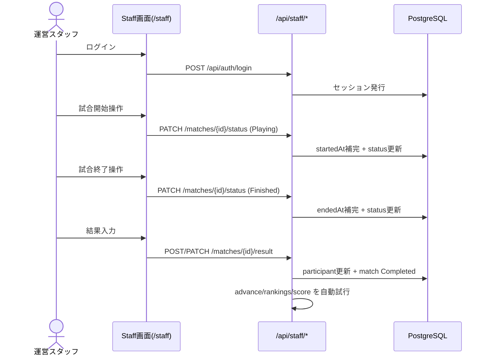
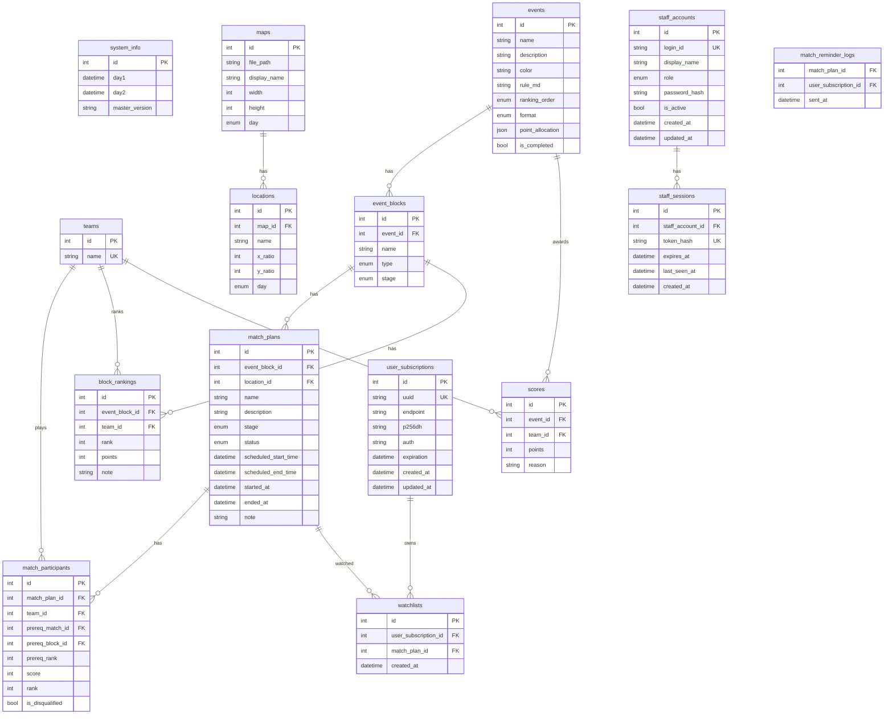

# 令和8年度体育大会App に関する企画･設計書（実装準拠版）
<p style="text-align: right;">
v2.0<br/>
令和8年5月23日<br/>
実装同期版（sportsfest2026）
</p>

## 1. 企画
### 1.1. 企画概要
本Webアプリ（以下、体育大会App）は、本校体育大会における試合予定・試合進行・試合結果・種目得点を、一般利用者と運営スタッフが共通のデータ基盤で確認・更新できるようにすることを目的とする。  
本版は `docs/SpecificationsV1.md` 作成後の実装差分を反映した「現行コード準拠仕様」である。

### 1.2. 本アプリが解決する課題
- 進行状況・結果確認のために現地掲示へ都度移動する必要がある
- 運営本部での得点集計時に、伝達遅延・記録漏れ・整合崩れが起きる
- 応援対象試合の開始直前把握が難しい

本アプリは、公開画面での準リアルタイム表示、運営画面での段階的更新（ステータス更新→結果登録→順位確定→得点確定）により上記を解消する。

### 1.3. ステークホルダー
- 一般利用者（学生・教員）
- 体育大会実行委員会（STAFF運用者）
- システム管理者（ADMIN運用者）
- 開発・保守担当（Web/API/DB）

### 1.4. 当日運用フロー（実装準拠）


---

## 2. 要件定義
### 2.1. ページ割（現行実装）
#### 2.1.1. 一般公開ページ
- `/`
  - 試合状態（開催予定/進行中/結果）フィルタ
  - 並び順（開始順/終了順）切り替え
  - 試合カード一覧
  - PWA導線、通知設定導線
  - 自チーム設定
- `/event`
  - 種目切替
  - 進行中/以降/終了試合表示
  - 概要表示
  - 対戦表表示（リーグ/トーナメント）
- `/schedule`
  - 時系列試合表示
  - 天気バッジ表示
- `/map`
  - マップ表示、会場選択
- `/match/:match_id`
  - 試合詳細ページ
- `/(public)/@modal/(.)match/:match_id`
  - モーダル遷移（Intercepting Route）

#### 2.1.2. 認証ページ
- `/login`
  - `loginId/password` 認証
  - ロールに応じたリダイレクト

#### 2.1.3. スタッフページ
- `/staff`
  - 会場フィルタ
  - 試合ステータス更新
  - 試合結果入力
  - 種目得点確定実行
- `/staff/scores`
  - チーム合計点
  - 得点積算履歴

#### 2.1.4. 管理ページ（ADMIN限定）
- `/system/admin/data-control`
  - maps/teams/locations/events/event-blocks/matches/users/block-rankings の CRUD
  - import/export、プレビュー
- `/system/admin/data-input`
  - EventBlock単位の試合一括投入
- `/system/admin/rankings`
  - ブロック順位手動置換
- `/system/admin/scores`
  - 試合結果修正、順位確定、勝ち上がり反映、得点確定
- `/system/admin/users`
  - 管理ユーザー管理
- `/system/create/*`
  - 入力補助ページ（Teams/Events/EventBlocks/Locations/Matches）
  - 最終的にはページは残しつつ没に\
    一番の使用目的である`matches`について、前の試合結果に依存する試合のIDが実際にDBに格納されるまで確定しないため、逐一DBに保存してデータを作るほうが良いと判断したため

### 2.2. 認証・認可要件
- 認証方式: Cookieセッション
- `/api/staff/*`: `ADMIN | STAFF`
- `/api/admin/*`: `ADMIN`
- フロント画面制御: `AuthGuard`

### 2.3. 非機能要件（実装反映）
- 公開APIは ETag/If-None-Match による 304 応答に対応
- ライブデータは15秒周期で再取得（SWR）
- Push通知は Service Worker と Web Push を使用
- 通知リマインドは cron（毎分）で実行

---

## 3. 仕様設計
### 3.1. DB設計


#### 3.1.1. 実装上の主な制約
- `teams.name` は一意
- `user_subscriptions.uuid` は一意
- `watchlists(user_subscription_id, match_plan_id)` は一意
- `block_rankings(event_block_id, team_id)` は一意
- `match_reminder_logs(match_plan_id, user_subscription_id)` は一意

#### 3.1.2. Drizzle DBスキーマ（現行実装）
- 実装ファイル
  - `apps/api/src/db/enums.ts`
  - `apps/api/src/db/schema.ts`

```typescript
import { pgEnum } from 'drizzle-orm/pg-core'

export const rankingOrderEnum = pgEnum('ranking_order', ['ASC', 'DESC'])
export const blockTypeEnum = pgEnum('block_type', ['LEAGUE', 'TOURNAMENT', 'CUMULATIVE', 'SINGLE'])
export const eventFormatEnum = pgEnum('event_format', ['TOURNAMENT', 'LEAGUE_TO_TOURNAMENT', 'HEATS_AND_FINAL'])
export const stageEnum = pgEnum('stage', ['FINAL', 'THIRD_PLACE', 'SEMIFINAL', 'QUARTERFINAL', 'ROUND_2', 'ROUND_1', 'QUALIFIER', 'CONSOLATION'])
export const matchStatusEnum = pgEnum('match_status', ['Waiting', 'Preparing', 'Playing', 'Finished', 'Completed', 'Cancelled'])
export const staffRoleEnum = pgEnum('staff_role', ['ADMIN', 'STAFF'])
export const dayEnum = pgEnum('day', ['day1', 'day2', 'both'])
```

```typescript
import {
  pgTable,
  serial,
  integer,
  varchar,
  text,
  boolean,
  timestamp,
  jsonb,
  unique,
  index
} from 'drizzle-orm/pg-core'

export const systemInfo = pgTable('system_info', {
  id: serial('id').primaryKey(),
  day1: timestamp('day1', { withTimezone: true }).notNull(),
  day2: timestamp('day2', { withTimezone: true }).notNull(),
  masterVersion: varchar('master_version', { length: 255 }).notNull()
})

export const teams = pgTable('teams', {
  id: serial('id').primaryKey(),
  name: varchar('name', { length: 100 }).notNull().unique()
})

export const maps = pgTable('maps', {
  id: serial('id').primaryKey(),
  filePath: varchar('file_path', { length: 255 }).notNull(),
  displayName: varchar('display_name', { length: 100 }).notNull(),
  width: integer('width').notNull(),
  height: integer('height').notNull(),
  day: dayEnum('day').notNull().default('both')
})

export const locations = pgTable(
  'locations',
  {
    id: serial('id').primaryKey(),
    mapId: integer('map_id').notNull().references(() => maps.id, { onDelete: 'cascade' }),
    name: varchar('name', { length: 100 }).notNull(),
    xRatio: integer('x_ratio').notNull(),
    yRatio: integer('y_ratio').notNull(),
    day: dayEnum('day').notNull().default('both')
  },
  (t) => ({
    mapIdx: index('locations_map_idx').on(t.mapId)
  })
)

export const events = pgTable('events', {
  id: serial('id').primaryKey(),
  name: varchar('name', { length: 100 }).notNull(),
  description: text('description'),
  color: varchar('color', { length: 7 }),
  ruleMd: text('rule_md'),
  rankingOrder: rankingOrderEnum('ranking_order').notNull(),
  format: eventFormatEnum('format').notNull(),
  pointAllocation: jsonb('point_allocation').notNull(),
  isCompleted: boolean('is_completed').notNull().default(false)
})

export const eventBlocks = pgTable(
  'event_blocks',
  {
    id: serial('id').primaryKey(),
    eventId: integer('event_id').notNull().references(() => events.id, { onDelete: 'cascade' }),
    name: varchar('name', { length: 100 }).notNull(),
    type: blockTypeEnum('type').notNull(),
    stage: stageEnum('stage').notNull()
  },
  (t) => ({
    eventIdx: index('event_blocks_event_idx').on(t.eventId)
  })
)

export const matchPlans = pgTable(
  'match_plans',
  {
    id: serial('id').primaryKey(),
    eventBlockId: integer('event_block_id').notNull().references(() => eventBlocks.id, { onDelete: 'cascade' }),
    locationId: integer('location_id').references(() => locations.id, { onDelete: 'set null' }),
    name: varchar('name', { length: 100 }),
    description: text('description'),
    stage: stageEnum('stage').notNull(),
    status: matchStatusEnum('status').notNull().default('Waiting'),
    scheduledStartTime: timestamp('scheduled_start_time', { withTimezone: true }).notNull(),
    scheduledEndTime: timestamp('scheduled_end_time', { withTimezone: true }).notNull(),
    startedAt: timestamp('started_at', { withTimezone: true }),
    endedAt: timestamp('ended_at', { withTimezone: true }),
    note: text('note')
  },
  (t) => ({
    blockIdx: index('match_plans_block_idx').on(t.eventBlockId),
    statusIdx: index('match_plans_status_idx').on(t.status),
    timeIdx: index('match_plans_start_idx').on(t.scheduledStartTime)
  })
)

export const matchParticipants = pgTable(
  'match_participants',
  {
    id: serial('id').primaryKey(),
    matchPlanId: integer('match_plan_id').notNull().references(() => matchPlans.id, { onDelete: 'cascade' }),
    teamId: integer('team_id').references(() => teams.id, { onDelete: 'set null' }),
    prereqMatchId: integer('prereq_match_id').references(() => matchPlans.id, { onDelete: 'set null' }),
    prereqBlockId: integer('prereq_block_id').references(() => eventBlocks.id, { onDelete: 'set null' }),
    prereqRank: integer('prereq_rank'),
    score: integer('score'),
    rank: integer('rank'),
    isDisqualified: boolean('is_disqualified').notNull().default(false)
  },
  (t) => ({
    matchIdx: index('participants_match_idx').on(t.matchPlanId)
  })
)

export const blockRankings = pgTable(
  'block_rankings',
  {
    id: serial('id').primaryKey(),
    eventBlockId: integer('event_block_id').notNull().references(() => eventBlocks.id, { onDelete: 'cascade' }),
    teamId: integer('team_id').notNull().references(() => teams.id, { onDelete: 'cascade' }),
    rank: integer('rank').notNull(),
    points: integer('points').notNull(),
    note: text('note')
  },
  (t) => ({
    uniqueTeam: unique('block_team_unique').on(t.eventBlockId, t.teamId)
  })
)

export const scores = pgTable(
  'scores',
  {
    id: serial('id').primaryKey(),
    eventId: integer('event_id').notNull().references(() => events.id, { onDelete: 'cascade' }),
    teamId: integer('team_id').notNull().references(() => teams.id, { onDelete: 'cascade' }),
    points: integer('points').notNull(),
    reason: text('reason')
  },
  (t) => ({
    teamIdx: index('scores_team_idx').on(t.teamId)
  })
)

export const userSubscriptions = pgTable('user_subscriptions', {
  id: serial('id').primaryKey(),
  uuid: varchar('uuid', { length: 255 }).notNull().unique(),
  endpoint: text('endpoint').notNull(),
  p256dh: text('p256dh').notNull(),
  auth: text('auth').notNull(),
  expiration: timestamp('expiration', { withTimezone: true }),
  createdAt: timestamp('created_at', { withTimezone: true }).notNull().defaultNow(),
  updatedAt: timestamp('updated_at', { withTimezone: true }).notNull().defaultNow()
})

export const watchlists = pgTable(
  'watchlists',
  {
    id: serial('id').primaryKey(),
    userSubscriptionId: integer('user_subscription_id').notNull().references(() => userSubscriptions.id, { onDelete: 'cascade' }),
    matchPlanId: integer('match_plan_id').notNull().references(() => matchPlans.id, { onDelete: 'cascade' }),
    createdAt: timestamp('created_at', { withTimezone: true }).notNull().defaultNow()
  },
  (t) => ({
    uniqueWatch: unique('watch_unique').on(t.userSubscriptionId, t.matchPlanId)
  })
)

export const staffAccounts = pgTable(
  'staff_accounts',
  {
    id: serial('id').primaryKey(),
    loginId: varchar('login_id', { length: 100 }).notNull().unique(),
    displayName: varchar('display_name', { length: 100 }).notNull(),
    role: staffRoleEnum('role').notNull(),
    passwordHash: text('password_hash').notNull(),
    isActive: boolean('is_active').notNull().default(true),
    createdAt: timestamp('created_at', { withTimezone: true }).notNull().defaultNow(),
    updatedAt: timestamp('updated_at', { withTimezone: true }).notNull().defaultNow()
  },
  (t) => ({
    roleIdx: index('staff_accounts_role_idx').on(t.role),
    activeIdx: index('staff_accounts_active_idx').on(t.isActive)
  })
)

export const staffSessions = pgTable(
  'staff_sessions',
  {
    id: serial('id').primaryKey(),
    staffAccountId: integer('staff_account_id').notNull().references(() => staffAccounts.id, { onDelete: 'cascade' }),
    tokenHash: varchar('token_hash', { length: 64 }).notNull().unique(),
    expiresAt: timestamp('expires_at', { withTimezone: true }).notNull(),
    lastSeenAt: timestamp('last_seen_at', { withTimezone: true }).notNull().defaultNow(),
    createdAt: timestamp('created_at', { withTimezone: true }).notNull().defaultNow()
  },
  (t) => ({
    accountIdx: index('staff_sessions_account_idx').on(t.staffAccountId),
    expiresIdx: index('staff_sessions_expires_idx').on(t.expiresAt)
  })
)

export const matchReminderLogs = pgTable(
  'match_reminder_logs',
  {
    matchPlanId: integer('match_plan_id').notNull().references(() => matchPlans.id, { onDelete: 'cascade' }),
    userSubscriptionId: integer('user_subscription_id').notNull().references(() => userSubscriptions.id, { onDelete: 'cascade' }),
    sentAt: timestamp('sent_at', { withTimezone: true }).notNull().defaultNow()
  },
  (t) => ({
    uniqueReminder: unique('match_reminder_unique').on(t.matchPlanId, t.userSubscriptionId)
  })
)
```

#### (参考) TypeScriptで記述した型定義（現行実装準拠）
```typescript
export type MatchStatus = 'Waiting' | 'Preparing' | 'Playing' | 'Finished' | 'Completed' | 'Cancelled'
export type RankingOrder = 'ASC' | 'DESC'
export type BlockType = 'LEAGUE' | 'TOURNAMENT' | 'CUMULATIVE' | 'SINGLE'
export type EventFormat = 'TOURNAMENT' | 'LEAGUE_TO_TOURNAMENT' | 'HEATS_AND_FINAL'
export type Stage =
  | 'FINAL' | 'THIRD_PLACE' | 'SEMIFINAL' | 'QUARTERFINAL'
  | 'ROUND_2' | 'ROUND_1' | 'QUALIFIER' | 'CONSOLATION'
export type Day = 'day1' | 'day2' | 'both'

export type PointAllocation = {
  MATCH?: Partial<Record<Stage, Record<string, number>>>
  BLOCK?: Partial<Record<Stage, Record<string, number>>>
}

export type PublicMasterResponse = {
  systemInfo: { day1: string; day2: string; masterVersion: string }
  matches: MatchData[]
  blocks: EventBlockData[]
  blockRankings: BlockRankingData[]
  scores: ScoreData[]
  maps: MapData[]
  locations: LocationData[]
  teams: TeamData[]
  events: EventData[]
}

export type PublicLiveResponse = {
  matches: MatchData[]
  blockRankings: BlockRankingData[]
  scores: ScoreData[]
}

export type MapData = {
  id: number
  filePath: string
  displayName: string
  width: number
  height: number
  day: Day
}

export type LocationData = {
  id: number
  mapId: number
  name: string
  xRatio: number
  yRatio: number
  day: Day
}

export type TeamData = {
  id: number
  name: string
}

export type EventData = {
  id: number
  name: string
  description: string | null
  color: string | null
  ruleMd: string | null
  rankingOrder: RankingOrder
  format: EventFormat
  pointAllocation: PointAllocation
  isCompleted: boolean
}

export type ParticipantData = {
  id: number
  teamId: number | null
  prereqMatchId: number | null
  prereqBlockId: number | null
  prereqRank: number | null
  score: number | null
  rank: number | null
  isDisqualified: boolean
}

export type MatchData = {
  id: number
  eventBlockId: number
  locationId: number | null
  name: string | null
  description: string | null
  stage: Stage
  status: MatchStatus
  scheduledStartTime: string
  scheduledEndTime: string
  startedAt: string | null
  endedAt: string | null
  note: string | null
  participants: ParticipantData[]
}

export type BlockRankingData = {
  eventBlockId: number
  teamId: number
  rank: number
  points: number
  note: string | null
}

export type EventBlockData = {
  id: number
  eventId: number
  name: string
  type: BlockType
  stage: Stage
  rankings: BlockRankingData[]
}

export type ScoreData = {
  id: number
  eventId: number
  teamId: number
  points: number
  reason: string | null
}
```

### 3.2. API設計
#### 3.2.1. エンドポイント一覧
| 対象 | エンドポイント | メソッド | 役割 |
| ---- | -------------- | -------- | ---- |
| 公開 | `/api/public/master` | GET | 全マスタデータ取得（ETag対応） |
| 公開 | `/api/public/live` | GET | ライブデータ取得（ETag対応） |
| 公開 | `/api/public/subscriptions` | POST / PUT | 通知購読の作成・更新 |
| 公開 | `/api/public/watchlist` | GET / POST / DELETE | ウォッチリスト取得・追加・削除 |
| 認証 | `/api/auth/login` | POST | ログイン |
| 認証 | `/api/auth/logout` | POST | ログアウト |
| 認証 | `/api/auth/session` | GET | セッション確認 |
| スタッフ | `/api/staff/matches/{matchId}/status` | PATCH | 試合ステータス更新 |
| スタッフ | `/api/staff/matches/{matchId}/result` | POST / PATCH | 試合結果登録・修正 |
| スタッフ | `/api/staff/events/:eventId/advance` | POST | 勝ち上がり反映 |
| スタッフ | `/api/staff/events/:eventId/rankings` | POST | 予選順位確定 |
| スタッフ | `/api/staff/events/:eventId/score` | POST | 種目得点確定 |
| 管理 | `/api/admin/maps` | GET / POST | マップ一覧・作成 |
| 管理 | `/api/admin/maps/{id}` | PUT / DELETE | マップ更新・削除 |
| 管理 | `/api/admin/teams` | GET / POST | チーム一覧・作成 |
| 管理 | `/api/admin/teams/{id}` | PUT / DELETE | チーム更新・削除 |
| 管理 | `/api/admin/locations` | GET / POST | 会場一覧・作成 |
| 管理 | `/api/admin/locations/{id}` | PUT / DELETE | 会場更新・削除 |
| 管理 | `/api/admin/events` | GET / POST | 種目一覧・作成 |
| 管理 | `/api/admin/events/{id}` | PUT / DELETE | 種目更新・削除 |
| 管理 | `/api/admin/event-blocks` | GET / POST | ブロック一覧・作成 |
| 管理 | `/api/admin/event-blocks/{id}` | PUT / DELETE | ブロック更新・削除 |
| 管理 | `/api/admin/matches` | POST | 試合作成 |
| 管理 | `/api/admin/matches/{id}` | PUT / DELETE | 試合更新・削除 |
| 管理 | `/api/admin/users` | GET / POST | 管理ユーザー一覧・作成 |
| 管理 | `/api/admin/users/{id}` | PUT / DELETE | 管理ユーザー更新・削除 |
| 管理 | `/api/admin/block-rankings` | GET | ブロック順位一覧 |
| 管理 | `/api/admin/block-rankings/block/{eventBlockId}` | PUT | 指定ブロック順位全置換 |
| システム | `/api/system/` | GET | サービス情報 |
| システム | `/api/system/health` | GET | ヘルスチェック |
| システム | `/api/system/debug/push/test` | POST | 手動Pushテスト（ADMIN） |

#### 3.2.2. 主要API詳細
##### A) `/api/public/master`（GET）
| 項目 | 内容 |
| ---- | ---- |
| 認証 | 不要 |
| 正常 | 200（マスタ全体） |
| 変更なし | 304 |
| 失敗 | 500 |
| 備考 | `ETag` を返却。`If-None-Match` 一致時は304 |

##### B) `/api/public/live`（GET）
| 項目 | 内容 |
| ---- | ---- |
| 認証 | 不要 |
| 正常 | 200（matches/blockRankings/scores） |
| 変更なし | 304 |
| 失敗 | 500 |
| 備考 | JST当日の `Preparing/Playing/Finished/Completed/Cancelled` 試合を返却 |

##### C) `/api/staff/matches/{matchId}/status`（PATCH）
| 項目 | 内容 |
| ---- | ---- |
| 認証 | STAFF以上 |
| 入力 | `{ status }` |
| 正常 | 200 |
| 失敗 | 404, 500 |
| 補正 | `Playing` 時に `startedAt` 補完・`endedAt=null`、`Finished` 時に `endedAt` 補完 |

##### D) `/api/staff/matches/{matchId}/result`（POST/PATCH）
| 項目 | 内容 |
| ---- | ---- |
| 認証 | STAFF以上 |
| 入力 | `{ participants: [{ participantId, score?, rank?, isDisqualified? }] }` |
| 正常 | 200 |
| 失敗 | 404, 409, 422, 500 |
| 備考 | 成功時に `status=Completed`。結果登録後に advance/rankings/score を自動試行 |

##### E) `/api/staff/events/:eventId/rankings`（POST）
| 項目 | 内容 |
| ---- | ---- |
| 認証 | STAFF以上 |
| 正常 | 200 |
| 失敗 | 404, 409, 500 |
| 備考 | `LEAGUE` ブロックのみ対象。未完了ブロックは処理対象外 |

##### F) `/api/staff/events/:eventId/score`（POST）
| 項目 | 内容 |
| ---- | ---- |
| 認証 | STAFF以上 |
| 正常 | 200 |
| 失敗 | 404, 409, 422 |
| 備考 | 既存 `scores` を削除して再生成。成功時 `events.isCompleted=true` |

### 3.3. ライブ統合仕様（Web側）
- `master.matches` をベースに `live.matches` の同一IDを上書き
- `Waiting` かつ participant の `teamId` が全員確定済みなら表示上 `Preparing`
- 15秒間隔で `live` を再検証、ETag一致時は再描画を抑制

### 3.4. Push通知仕様
- 通知購読
  - `public/subscriptions` へ uuid + endpoint + keys を送信
- ウォッチリスト
  - 通知無効時は LocalStorage
  - 通知有効時はサーバーwatchlistへ同期
- 定期通知
  - 毎分実行
  - 開始5〜10分前、かつ `Waiting/Preparing` の試合を通知
  - 送信済み重複防止: `match_reminder_logs`

---

## 4. 既知の制約・注意点
- `public/live` は「JST当日分」のみを返す
- 対戦表プレビューは block種別により表示差分がある（`CUMULATIVE`/`SINGLE` は限定表示）
- 得点確定は `pointAllocation` の整合性に依存し、不整合時は422

---

## 5. 実装再現のための最小開発順
1. DBスキーマ・Enum作成
2. 認証APIとロールミドルウェア
3. `public/master`・`public/live` とETag
4. staff運用API（status/result/advance/rankings/score）
5. admin CRUD API
6. 公開画面（トップ・種目・スケジュール・マップ・試合詳細）
7. スタッフ画面・管理画面
8. PWA + Push + cron通知
