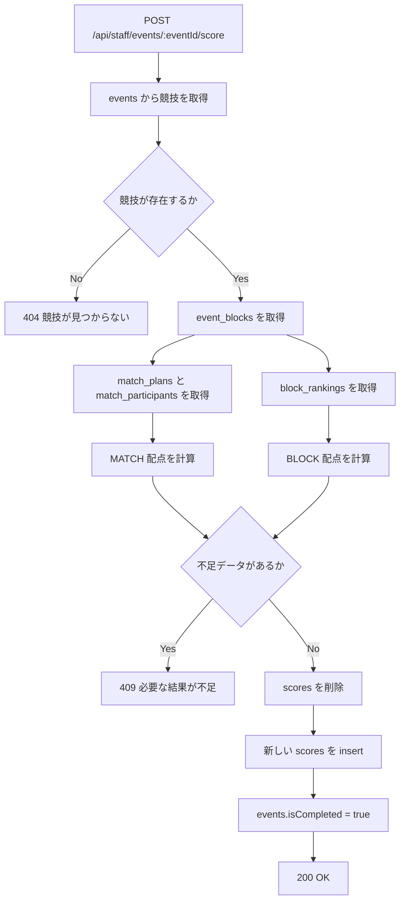

# スコア計算ロジック

このドキュメントでは、支部向け API `POST /api/staff/events/:eventId/score` が
どのように最終得点を計算しているかをまとめます。  
フロントエンド担当者が「何を入力として、何が出力され、どこで失敗するか」を追えることを目的にしています。

## この API がやること

この API は、ある競技 1 つ分の最終得点を確定します。

やっていることを一言でいうと、次の通りです。

1. 競技の配点ルールを読む
2. その競技に属する試合結果とブロック順位を読む
3. 配点ルールに従って `scores` テーブルを再生成する
4. 競技を `isCompleted = true` に更新する

重要なのは、この API は「手入力で得点を送る」のではなく、
**すでに登録済みの試合結果や順位表から、自動で最終得点を計算する**ことです。

## 関係するデータ

この API で主に参照するテーブルは次の 5 つです。

| テーブル | 役割 |
| --- | --- |
| `events` | 競技本体。`pointAllocation` に配点ルールが入っている |
| `event_blocks` | 競技配下のブロック一覧 |
| `match_plans` | 試合一覧。`stage` と `status` を使う |
| `match_participants` | 試合ごとのチーム順位。`teamId` と `rank` を使う |
| `block_rankings` | ブロック順位。`teamId` と `rank` を使う |
| `scores` | 最終的に再生成される大会得点 |

## 配点ルールの見方

配点ルールは `events.pointAllocation` に入っています。

```ts
{
  MATCH: {
    FINAL: { "1": 30, "2": 20 },
    THIRD_PLACE: { "1": 15, "2": 10 }
  },
  BLOCK: {
    QUALIFIER: { "1": 3, "2": 1, "3": 0 }
  }
}
```

意味は次の通りです。

- `MATCH`
  - 試合結果から直接加点する
  - 例: 決勝の 1 位に 30 点、2 位に 20 点
- `BLOCK`
  - ブロック順位から加点する
  - 例: 予選ブロック 1 位に 3 点、2 位に 1 点

つまり、

- 「何点入るか」 は `pointAllocation`
- 「どのチームが何位だったか」 は `match_participants.rank` または `block_rankings.rank`

を組み合わせて計算しています。

## 全体フロー



## 入出力のイメージ

### API リクエスト

リクエストボディはありません。パスパラメータの `eventId` だけを使います。

```http
POST /api/staff/events/2/score
```

### API レスポンス

成功時は、その競技で確定した `scores` 一覧を返します。

```json
{
  "eventId": 2,
  "isCompleted": true,
  "scores": [
    {
      "eventId": 2,
      "teamId": 1,
      "points": 3,
      "reason": "バレーボール 予選1位"
    },
    {
      "eventId": 2,
      "teamId": 3,
      "points": 1,
      "reason": "バレーボール 予選2位"
    }
  ]
}
```

## どこを見て計算しているか

### 1. 競技を取得する

最初に `events` から対象競技を取得します。

ここで見るのは主に次の 2 つです。

- `name`
  - `reason` 生成に使う
- `pointAllocation`
  - 順位ごとの得点ルール

競技が見つからなければ `404` です。

### 2. 競技配下のブロックを取得する

次に `event_blocks` から、その競技に属するブロック一覧を取得します。

このブロック ID を使って、

- その競技の試合一覧
- その競技のブロック順位一覧

を引いています。

### 3. MATCH 配点を計算する

`pointAllocation.MATCH` がある場合、`match_plans` と `match_participants` を使って加点します。

#### 見ている値

- `match_plans.stage`
  - どの配点ルールを使うか
- `match_plans.status`
  - `Completed` まで終わっているか
- `match_participants.rank`
  - その試合での順位
- `match_participants.teamId`
  - 何点入るチームか

#### 例

配点ルールが次のとき:

```ts
MATCH: {
  FINAL: { "1": 30, "2": 20 },
  THIRD_PLACE: { "1": 15, "2": 10 }
}
```

試合結果が次のとき:

| 試合 | stage | status | 1位 | 2位 |
| --- | --- | --- | --- | --- |
| B-4 | `FINAL` | `Completed` | team 1 | team 3 |
| B-3 | `THIRD_PLACE` | `Completed` | team 2 | team 4 |

生成される `scores` は次の通りです。

| teamId | points | reason |
| --- | --- | --- |
| 1 | 30 | バスケットボール 決勝1位 |
| 3 | 20 | バスケットボール 決勝2位 |
| 2 | 15 | バスケットボール 3位決定戦1位 |
| 4 | 10 | バスケットボール 3位決定戦2位 |

### 4. BLOCK 配点を計算する

`pointAllocation.BLOCK` がある場合、`block_rankings` を使って加点します。

#### 見ている値

- `event_blocks.stage`
  - どの配点ルールを使うか
- `block_rankings.rank`
  - ブロック内順位
- `block_rankings.teamId`
  - 加点対象チーム

#### 例

配点ルールが次のとき:

```ts
BLOCK: {
  QUALIFIER: { "1": 3, "2": 1, "3": 0 }
}
```

ブロック順位が次のとき:

| ブロック | stage | 1位 | 2位 | 3位 |
| --- | --- | --- | --- | --- |
| Aブロック予選 | `QUALIFIER` | team 1 | team 3 | team 2 |

生成される `scores` は次の通りです。

| teamId | points | reason |
| --- | --- | --- |
| 1 | 3 | バレーボール 予選1位 |
| 3 | 1 | バレーボール 予選2位 |
| 2 | 0 | バレーボール 予選3位 |

### 5. MATCH と BLOCK の結果を合体する

最終的な `scores` は、

- `MATCH` 由来の加点
- `BLOCK` 由来の加点

を単純に 1 配列へまとめたものです。

この時点では、チームごとに 1 レコードへ合算はしていません。  
たとえば同じチームが

- 予選 1 位で 3 点
- 決勝 2 位で 18 点

を取った場合、`scores` テーブルには 2 レコード入ります。

例:

| eventId | teamId | points | reason |
| --- | --- | --- | --- |
| 2 | 1 | 3 | バレーボール 予選1位 |
| 2 | 1 | 18 | バレーボール 決勝2位 |

## 実際の DB 入出力イメージ

### 入力側

たとえば `eventId = 1` のバスケットボールで、次のデータがあるとします。

#### `events.pointAllocation`

```ts
{
  MATCH: {
    FINAL: { "1": 30, "2": 20 },
    THIRD_PLACE: { "1": 15, "2": 10 }
  }
}
```

#### `match_plans`

| id | name | stage | status |
| --- | --- | --- | --- |
| 3 | B-3 | `THIRD_PLACE` | `Completed` |
| 4 | B-4 | `FINAL` | `Completed` |

#### `match_participants`

| matchPlanId | teamId | rank |
| --- | --- | --- |
| 3 | 2 | 1 |
| 3 | 4 | 2 |
| 4 | 1 | 1 |
| 4 | 3 | 2 |

### 出力側

`scores` は次のように作り直されます。

| eventId | teamId | points | reason |
| --- | --- | --- | --- |
| 1 | 1 | 30 | バスケットボール 決勝1位 |
| 1 | 2 | 15 | バスケットボール 3位決定戦1位 |
| 1 | 3 | 20 | バスケットボール 決勝2位 |
| 1 | 4 | 10 | バスケットボール 3位決定戦2位 |

その後、`events.isCompleted` が `true` になります。

## エラーになる条件

### 404: 競技が存在しない

`eventId` に対応する `events` レコードが無い場合です。

```json
{
  "message": "対象競技が見つかりません"
}
```

### 409: 得点確定に必要なデータが不足している

次のような場合です。

- 配点ルールにある stage の試合が存在しない
- 配点対象の試合が `Completed` になっていない
- 配点対象順位の `match_participants.rank` が未入力
- 配点対象順位の `block_rankings.rank` が未入力

```json
{
  "message": "得点確定に必要な試合結果または順位データが不足しています"
}
```

## フロントエンド担当者向けの見方

フロントエンド視点では、この API は次のように理解すると分かりやすいです。

- 入力は `eventId` だけ
- 配点ルールは画面から送っていない
- 得点はサーバー側で自動計算される
- 失敗時は「まだ結果入力が足りない」と考えると理解しやすい

特に重要なのは、`POST /api/staff/events/:eventId/score` を叩いても
その場で何かの順位を送信しているわけではない、という点です。

この API は、**すでに別 API や運用で登録済みの結果を集計して確定するボタン**に近い役割です。

## 実装ファイル

実装本体は次のファイルです。

- [apps/api/src/repositories/staff/events.ts](../apps/api/src/repositories/staff/events.ts)
- [apps/api/src/routes/staff/events.ts](../apps/api/src/routes/staff/events.ts)
- [apps/api/src/schemas/staff/events.ts](../apps/api/src/schemas/staff/events.ts)
